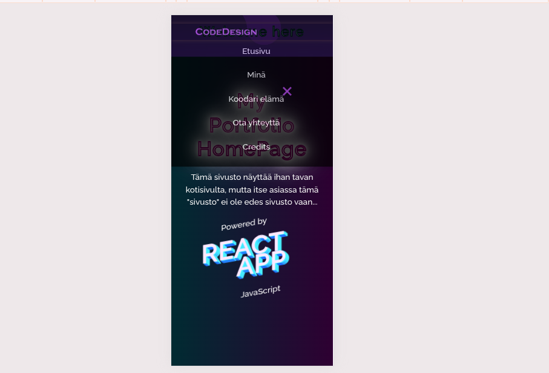
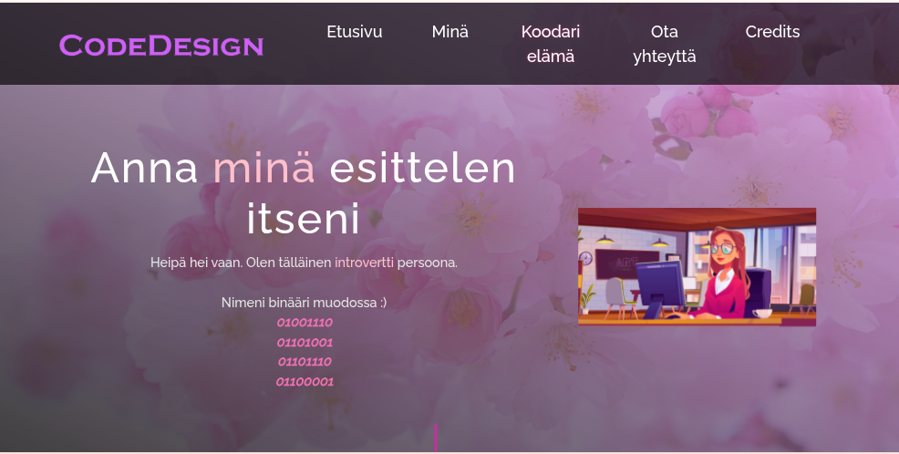
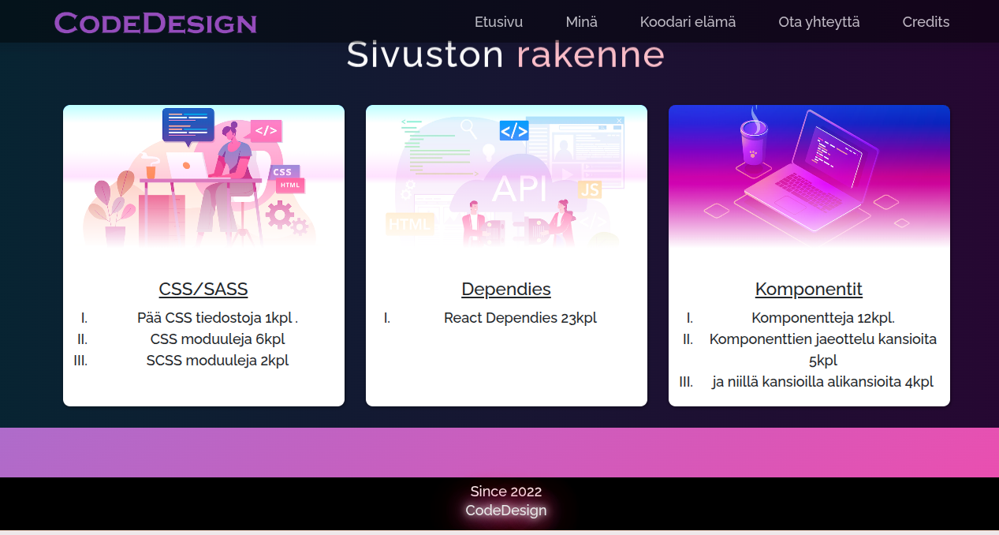
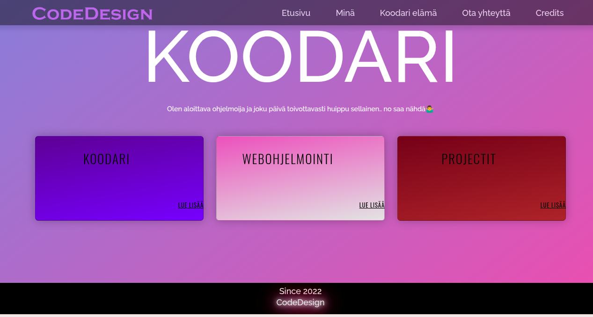
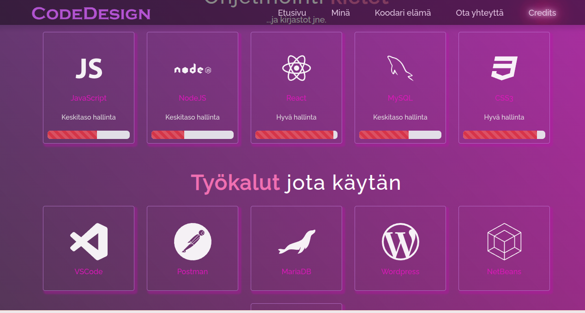

# 💜 My First React Page 🩷

✨ Ensimmäinen oma **React** verkkosivuni – 2022 👩‍💻

Tämä projekti on minun ensimmäinen itse rakentamani portfolio- ja esittelysivu vuodelta **2022**.

Sivustolla esittelen itseäni, kiinnostustani ohjelmointiin sekä matkaa kohti koodariksi kasvamista. 💜

Tämä on ajalta, jolloin opettelin asioita itse, kokeilin, rikoin ja rakensin uudelleen.


**No AI. Just me, code, Google and a lot of trial and error.** 💻💜

> *Every coder has a first project.*
> *This was mine.* 🌸


**Ja kyllä — tämä tehtiin ilman tekoälyä.** 🫶

* Kaikki ongelmat piti silloin selvittää itse.
* Google oli kaveri. 
* Stack Overflow oli tietolähde. Muistaako kukaan enää?
* Ja välillä ratkaisu oli vain:

```text
"miksi tämä ei toimi?! Miksi tämä toimii?" 🌷
```

---

## 🌸 Ensimmäinen oma React-projekti

Tämä oli yksi ensimmäisistä projekteistani, joissa pääsin kunnolla käsiksi Reactiin ja JavaScriptiin.

Projektin kautta opettelin muun muassa:

* ⚛️ Reactin perusteita
* 🟨 JavaScriptiä
* 🎨 CSS:n käyttöä
* 🧩 komponenttipohjaista ajattelua
* 🌐 verkkosivun rakentamista
* 💻 frontend-kehityksen perusteita

---

## 🕰️ Koodarityttö vuonna 2022

Tavoitteena ei ollut rakentaa täydellistä tuotetta.

Tavoitteena oli **oppia tekemään itse**.

Ja juuri siksi tällä projektilla on edelleen oma paikkansa GitHubissa. 🌸

Vuonna 2022 tämä oli minulle iso askel.

Nykyään katson projektia hieman eri silmin — ja huomaan hyvin, kuinka paljon sen jälkeen on tullut opittua. 😄

Mutta ensimmäisiä projekteja ei tarvitse hävetä.

Ne näyttävät, **mistä kaikki alkoi.** 💜

---





